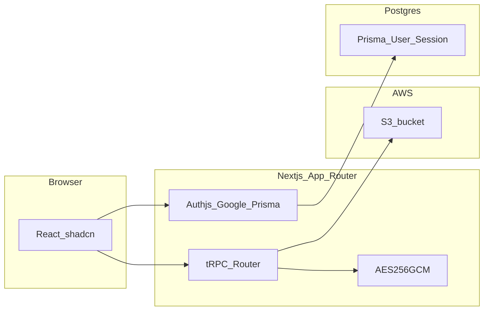

# Architecture

## Overview

## Request flow

1. User hits `/login`, completes Google OAuth. Auth.js persists `User`, `Account`, and `Session` rows via Prisma.
2. The `signIn` callback rejects sign-ins whose email is not on `ALLOWED_EMAIL_DOMAIN`.
3. Authenticated users use tRPC (`/api/trpc`) from React Query. All vault procedures are **protected** and require a session.
4. For reads/writes, the server downloads or uploads S3 objects. Payloads are **decrypted only in memory** on the server using `ENCRYPTION_KEY`, then returned to the browser (plaintext in transit must be protected with TLS in production).

## Trust boundaries

| Component | Trust |
| --- | --- |
| `ENCRYPTION_KEY` | Server-only. Anyone who holds it can decrypt all vault objects. |
| AWS IAM credentials | Server (and operators running the CLI). Scope to `S3_ROOT_PREFIX` when possible. |
| PostgreSQL | Session and OAuth linkage; does not store secret file contents. |
| Browser | Sees decrypted content after successful auth and TLS. |

## Source of truth

- **S3** is the source of truth for secret files. The app does not mirror the bucket tree in Postgres.
- **Postgres** stores Auth.js tables only.

## Scaling notes

Listing collections and objects calls S3 `ListObjectsV2` on demand. Large buckets or high request volume may need caching or a secondary index; this MVP documents the tradeoff in [environment.md](environment.md) operational guidance.
